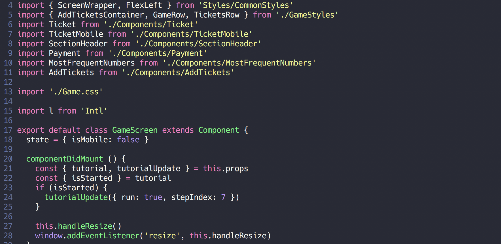

# Dotfiles

My awesome configs. Work in progress.

## Terminal

  Oh my zsh, zgen, powerlevel9k prompt, a lot of [useful plugins](https://github.com/andreystarkov/dotfiles/blob/master/zsh/zgen_setup.zsh)


## Vim/Nvim

  Vim-Plug with [some plugins](https://github.com/andreystarkov/dotfiles/blob/master/nvim/init.vim)



## macOS

  - Core clis/apps/libs/fonts listed at [Brewfile](https://github.com/andreystarkov/dotfiles/blob/master/Brewfile)
  - OS Tweaks & Settings at [shell script](https://github.com/andreystarkov/dotfiles/blob/master/mac/settings-default.sh)

## VSCode

  - Awesome [settings](https://github.com/andreystarkov/dotfiles/blob/master/vscode/settings.json)
  - [Plugins & Themes](https://github.com/andreystarkov/dotfiles/blob/master/vscode/extensions.json)
  - Sync settings [configuration gist](https://gist.github.com/andreystarkov/c5e523ad67b6f416fe2fab36007aad59)

## Quick start

```bash
  git clone https://github.com/andreystarkov/dotfiles ~/.dotfiles
  cd ~/.dotfiles
  bash ./setup.sh
```
