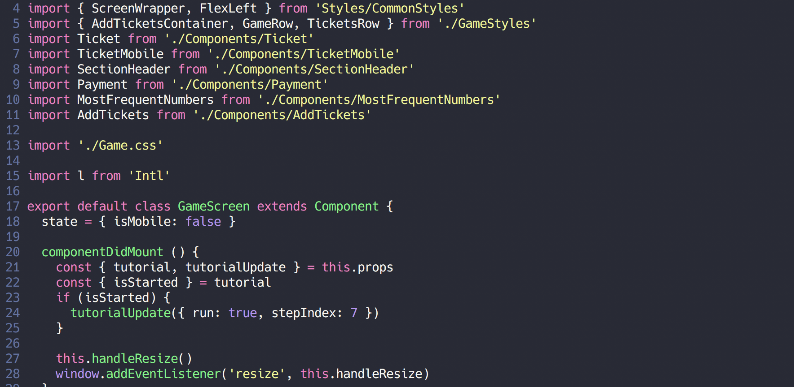

# Dotfiles

My awesome configs. Work in progress.

## Terminal
  Oh my zsh, zgen, powerlevel9k prompt, a lot of useful plugins


### Vim/Nvim
  Vim-Plug, Dracula theme, JS Dev Setup



## Quick start

Requires [Nerd fonts] (https://github.com/ryanoasis/nerd-fonts)

```bash
  git clone https://github.com/andreystarkov/dotfiles ~/dotfiles
  cd ~/dotfiles
  bash ./setup.sh
```
